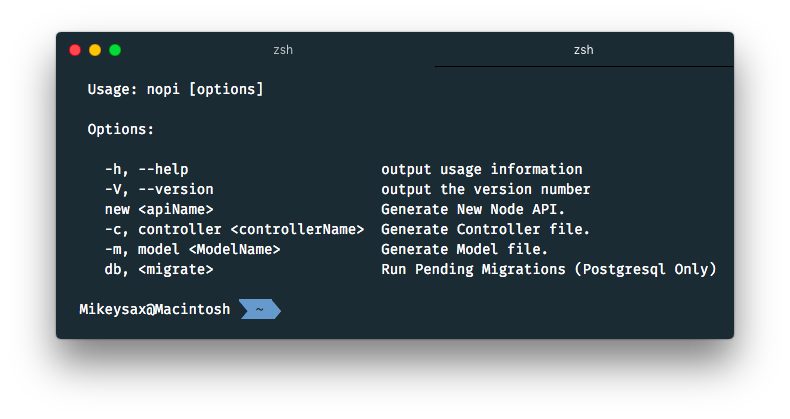

# nopi
### *Nopi* is a CLI Tool / Framework for generating a simple Node API and Files.


___
### Installation

<strong>To Install *Nopi*:</strong>

```$ npm install nopi.js -g```

To see a list of commands:

```$ nopi```
___
### Project Generation

<strong>To Generate a new API:</strong>

```$ nopi new apiName```

When you create a new project, *Nopi* will run ```npm install``` automatically in the created project directory. All you have to do is be patient, it is not frozen.

Once it is done, cd to API and start the server with:

```$ npm start```

### Database Selection

When generating a new API project, you can select from:

```mongo``` || ```postgres```

In your projects ```package.json``` there is a ```nopi_database``` field
which is used in Model file creation.

___
### File Generation

<strong>To generate a new controller or model file:</strong>

```$ nopi controller fileName```

```$ nopi model fileName```   

#### Controller Files

Controller files which are generated by *Nopi* should be added to the ```index.js``` controller file. Once added to the index, they are connected to the Express server. Within the Controller files generated by *Nopi*, you can route, create CRUD actions, and do anything you wish with your API.

#### Model Files

Model files which are generated by *Nopi* change depending on the type of project API that was generated. Within the ```package.json``` there is a ```nopi_database``` field with the type of DB chosen on generation.

*Nopi* uses this field inside the ```package.json``` to determine which Model file it needs to generate.

MongoDB: If ```mongo``` is chosen on API generation, ```mongoose.js``` is used by default and Models which work with ```mongoose.js``` which be chosen.

Postgresql: If ```postgres``` is chosen on API generation, ```sequelize.js``` is used and Models and Migrations used within ```sequelize.js``` will be generated.

<strong>Use these commands in the root of your project.</strong>

##### <strong>On File Creation Specifics:</strong>

On file creation, *Nopi* will look through your working project directory for controller and model folders and create the corresponding file type. If none of these folders exist, *Nopi* will create the file in the root of your project.

*Nopi* also creates ```.nopiPath``` folder in your project and saves the path of the file type generated. This is to optimize the speed of file creation. By saving this path *Nopi* does not have to dynamically find the folder again after each generated file.

If your project directory changes at all, delete ```.nopiPath``` folder to recache folder paths. ```.nopiPath``` folder is added to ```.gitignore``` also.

You cannot create files that already exist.

### Contribute
<strong>If you would like to contribute, it would be greatly appreciated.</strong>

___
#### <strong>For help and more commands:</strong>

```$ nopi -h``` | ```$ nopi -V``` | ```$ nopi```

___
